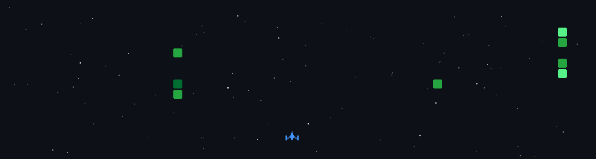

<div align="center">
  
</div>

<div align="center">
  
</div>

---

<h2 align="center">📡 SYSTEM STATUS: ONLINE</h2>

<div align="center">
  
</div>

<br>

<div align="center">
  
</div>

---

<h2 align="center">🚀 COGNITIVE CORE (SKILLS)</h2>

<div align="center">
  
</div>

---

<h2 align="center">🛡️ MISSION SECTOR: CONTRIBUTION DEFENSE</h2>
<p align="center"><i>Engaging enemy matrix invaders to protect the database grid. Actively committing code to refuel the plasma blasters!</i></p>

<div align="center">
  
</div>

---

<h2 align="center">📁 SYSTEM LOGS (ABOUT ME)</h2>

```yaml
pilot:
  name: Tran Nguyen Gia Huy
  alias: trangiahuy0701-wq
  origin: Vietnam, Earth (Sector 84)
  specialty: Web Systems, Hybrid Cloud, Cybernetic Interfaces
  status:
    active_mission: "Building Awesome Next-gen Platforms 🌌"
    focus_training: "Artificial Intelligence & Advanced Architecture 🧠"
    looking_for: "Collaboration on high-impact Open Source modules 🤝"
  contact:
    comms_channel: "trangiahuy0701@gmail.com"
```

---

<h2 align="center">🔗 COMMS CHANNELS</h2>

<p align="center">
  <a href="https://twitter.com/">
    
  </a>
  <a href="https://linkedin.com/in/">
    
  </a>
  <a href="https://facebook.com/">
    
  </a>
</p>

<div align="center">
  
</div>
